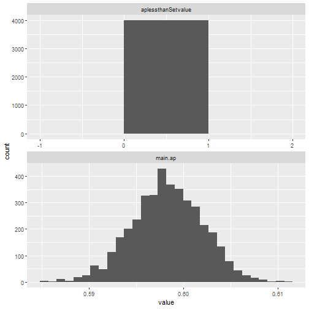
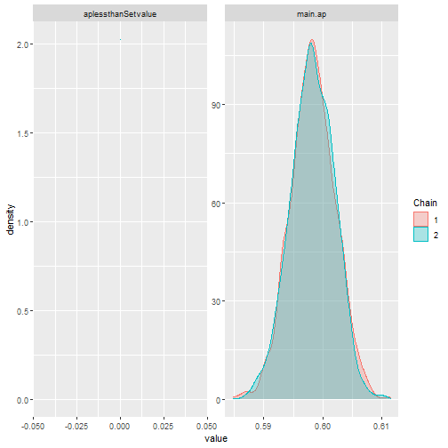
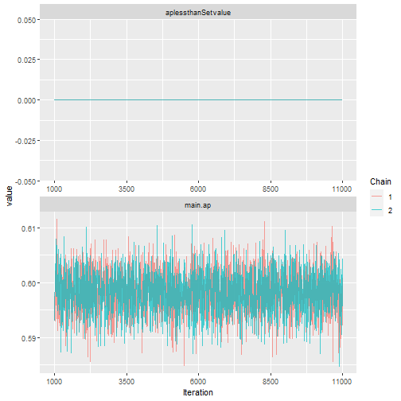
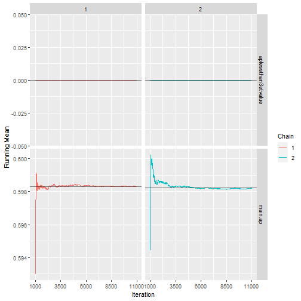
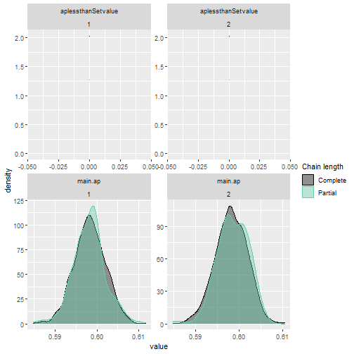
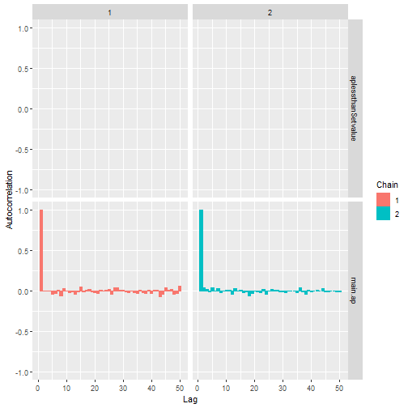

# TPpre-IWA dynamic report

## General information

This report has automatically been generated by the shiny web-application TPpre-IWA as an R Markdown document based on your data input and prior selection. The web-application can be found at <http://104.198.128.87:3838/TPpre_IWA/>. We advice users that after observing the results of this report to avoid re-updating their prior beliefs to avoid hampering the credibility of these results.

------------------------------------------------------------------------

The following section describes your input. During set-up the user assumed that:

1.  Single population modelled,
2.  No, zero prevalence was modeled,
3.  between the Apparent and True prevalence the Apparent prevalence was modelled and
4.  (the) Percentiles was used to elicitate prior knowledge.

------------------------------------------------------------------------

If the true prevalence (inline equation test: $\pi_{t}$) is modelled the following relation is utilized to acquire its posterior distribution, inline equation test: $\pi_{a} = \pi_{t}\cdot S_{e}(1-\pi_{t})\cdot (1-S_{p})$, where inline equation test: $S_{p},S_{e}$ denotes the specificity and sensitivity of the diagnostic test and inline equation test: $\pi_{a}$ the apparent prevalence.

------------------------------------------------------------------------

------------------------------------------------------------------------

## The elicited prior

The selected prior distribution of the Apparent prevalence has the following descriptive characteristics and density plot.


```
##    Min. 1st Qu.  Median    Mean 3rd Qu.    Max. 
## 0.01285 0.26892 0.40835 0.41931 0.55837 0.97600
```

<!--html_preserve--><div id="out6af9e250b323b0d0" style="width:100%; height:400px; " class="plotly html-widget html-widget-output shiny-report-size"></div><!--/html_preserve-->
<br>
<br>
------------------------------------------------------------------------

------------------------------------------------------------------------

## The data

A summary of the input data is provided below


```
## [1] "The sample size was set equal to 72, while the positive subjects were set equal to 14"
```

```
## [1] "The observed (apparent) prevalence was equal to 19.44%"
```

------------------------------------------------------------------------

------------------------------------------------------------------------

## The model

<!--html_preserve--><div id="out2ed0b504281d5d7e" style="width:100%; height:400px; " class="plotly html-widget html-widget-output shiny-report-size"></div><!--/html_preserve-->

------------------------------------------------------------------------

------------------------------------------------------------------------

## Diagnostics



------------------------------------------------------------------------

End of TPpre-IWA report.
